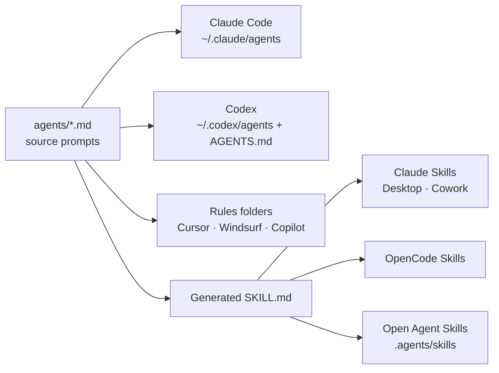

<p align="center">
  
</p>

<h1 align="center">Healthcare Agents</h1>

<p align="center">
  <strong>51 specialist AI agents for US healthcare administration.</strong><br>
  Installable prompts and skills for Claude Code, Codex, OpenCode, Cursor, Copilot, and other agentic coding tools.
</p>

<p align="center">
  <a href="#install"></a>
  <a href="#agent-catalog"></a>
  <a href="#eval-status"></a>
  <a href="#supported-tools"></a>
  <a href="https://github.com/ajhcs/healthcare-agents/releases/tag/v1.3.0"></a>
  <a href="LICENSE"></a>
</p>

<table>
  <tr>
    <td align="center"><strong>51</strong><br><sub>healthcare specialists</sub></td>
    <td align="center"><strong>10</strong><br><sub>administrative domains</sub></td>
    <td align="center"><strong>95.50</strong><br><sub>avg final-pass score</sub></td>
    <td align="center"><strong>Routing + SKILL.md</strong><br><sub>usable agent formats</sub></td>
  </tr>
</table>

Healthcare Agents is a model-agnostic prompt library for healthcare administration work: revenue cycle, quality and compliance, clinical operations, payer relations, health IT, population health, pharmacy programs, operations, strategy, and emergency preparedness.

Each agent is a long-form Markdown specialist with YAML frontmatter, role-specific source awareness, compliance boundaries, operational workflows, concrete deliverable templates, best-input guidance, output modes, and cross-agent handoff rules. The pack installs into tools that support subagents, custom instructions, repository rules, or `SKILL.md` folders.

## TL;DR

| You need | Healthcare Agents gives you |
|---|---|
| Healthcare-specific agent behavior | 51 narrow specialists instead of one generic "healthcare assistant." |
| Easier agent selection | CLI chooser, task-based docs, starter prompts, output modes, and handoff maps. |
| Practical administrative output | Appeal packets, audit binders, gap analyses, dashboards, charters, payer matrices, readiness plans, and workflow checklists. |
| Better regulatory handling | Role-aware references to HIPAA, CMS, OIG, HEDIS, Stars, MIPS/QPP, HRSA 340B, NHSN, TEFCA, HL7/FHIR, X12, and other domain sources. |
| Portable installation | Claude Code agents, Claude/OpenCode skills, Codex agent prompts, Cursor/Windsurf/Copilot rules, Aider context, and plain Markdown. |
| Prompt quality controls | An included self-improvement kit with a frozen rubric, role baselines, scorer guidance, and append-only eval results. |

These agents are for healthcare administration support. They are not clinicians, attorneys, auditors, coders of record, billing authorities, or a safe PHI-processing environment. See [Trust and Safety](docs/trust-and-safety.md) for scope, PHI, human escalation, source freshness, and eval limits.

## Install

Fast path:

```bash
npx --yes healthcare-agents install
```

GitHub-backed fallback:

```bash
npx --yes github:ajhcs/healthcare-agents install
```

Shell installer fallback:

```bash
curl -fsSL https://raw.githubusercontent.com/ajhcs/healthcare-agents/main/install.sh | bash
```

Target a specific tool:

| Runtime | Command |
|---|---|
| Claude Code subagents | `npx --yes healthcare-agents install --claude` |
| Claude Skills, Claude Desktop, Claude Cowork | `npx --yes healthcare-agents install --claude-skills` |
| Codex CLI / Codex App | `npx --yes healthcare-agents install --codex` |
| OpenCode skills | `npx --yes healthcare-agents install --opencode` |
| Open Agent Skills convention | `npx --yes healthcare-agents install --agent-skills` |
| Cursor rules | `npx --yes healthcare-agents install --cursor` |
| Windsurf rules | `npx --yes healthcare-agents install --windsurf` |
| GitHub Copilot instructions | `npx --yes healthcare-agents install --copilot` |
| All known targets | `npx --yes healthcare-agents install --all` |

Preview before writing files:

```bash
npx --yes healthcare-agents install --all --dry-run
```

Inspect local install targets and collisions:

```bash
npx --yes healthcare-agents doctor
```

Install one agent instead of the full pack:

```bash
npx --yes healthcare-agents install revenue-cycle-specialist --codex
```

Update existing installs:

```bash
npx --yes healthcare-agents install --all --force
```

Uninstall:

```bash
npx --yes healthcare-agents uninstall --all
```

## Choose the Right Agent

Start with the task, not the agent name. Use the [agent selection guide](docs/usage/agent-selection-guide.md) when you know the operational problem, the [starter prompts](docs/usage/starter-prompts.md) when you want copy-ready examples, and the [handoff map](docs/usage/handoff-map.md) when the request spans departments.

The CLI exposes the same discovery surface:

```bash
healthcare-agents list --domain revenue
healthcare-agents show revenue-cycle-specialist
healthcare-agents choose "clean claim rate dropped after an EHR update"
healthcare-agents prompt quality-compliance-officer --mode audit/checklist
```

Every agent now supports four output modes:

| Ask for | When to use it |
|---|---|
| `quick triage` | Symptoms, weak data, or first-pass root cause analysis |
| `workplan` | Owners, sequence, dependencies, KPIs, and timeline |
| `audit/checklist` | Evidence requests, pass/fail criteria, remediation owners |
| `artifact/template` | A draft work product with assumptions and placeholders |

Common starting points:

| You need | Start with |
|---|---|
| Clean claim or denial problem | `revenue-cycle-specialist` |
| Survey readiness | `quality-accreditation-specialist` |
| Prior authorization delays | `clinical-prior-authorization-specialist` |
| ED boarding or capacity issue | `operations-hospital-administrator` |
| Interface or FHIR issue | `healthit-interoperability-engineer` |
| Value-based care performance | `payer-value-based-care-manager` |
| Safety event or RCA | `quality-patient-safety-officer` |
| CHNA or community benefit | `pophealth-community-health-coordinator` |

## Quick Examples

Claude Code:

```text
Use the revenue-cycle-specialist agent in quick triage mode to diagnose why our clean claim rate dropped, then list coding, contract, and prior authorization handoffs.
```

Codex:

```text
Read the quality-compliance-officer healthcare agent and use audit/checklist mode to draft a HIPAA Security Rule evidence checklist for a small clinic.
```

OpenCode:

```text
Use the revenue-contract-analyst skill to model payer contract underpayment risk from a sample allowed-amount table.
```

Rules-based tools:

```text
Using the healthit-interoperability-engineer instructions, review this HL7v2 interface mapping for common ADT and ORU risks.
```

Manual project install:

```bash
git clone https://github.com/ajhcs/healthcare-agents.git
mkdir -p .claude/agents
cp healthcare-agents/agents/*.md .claude/agents/
```

## Why Use This

| Generic healthcare prompting | Healthcare Agents |
|---|---|
| "Follow HIPAA." | Separates Privacy Rule, Security Rule, Breach Notification, minimum necessary, BAAs, operational evidence, and escalation boundaries. |
| "Improve revenue." | Uses CARC/RARC, 837/835, charge capture, CDM, denial prevention, payer contracts, 340B, coding, and cost-report mechanics. |
| "Check quality." | Distinguishes HEDIS, MIPS/QPP, Stars, CAHPS/HCAHPS, accreditation, patient safety, infection prevention, and QI methodology. |
| "Analyze healthcare data." | Names FHIR, HL7v2, X12, C-CDA, Epic Caboodle/Cogito, USCDI, TEFCA, eCQMs, registries, and data-lineage controls. |
| "Make an operational plan." | Produces healthcare-specific work products: appeal packets, readiness binders, staffing models, audit trails, gap analyses, and KPI dashboards. |

## Supported Tools



| Tool / Standard | Install Target | Notes |
|---|---|---|
| Claude Code subagents | `~/.claude/agents/*.md` | Source prompts use lowercase hyphen `name` values matching filenames. |
| Claude Skills | `~/.claude/skills/<slug>/SKILL.md` | Generated skill wrappers include `name`, `description`, `license`, and `compatibility`. |
| Claude Desktop / Claude Cowork | Claude-compatible skills | Use `--claude-desktop`, `--claude-cowork`, or `--claude-skills`. |
| Codex CLI / Codex App | `~/.codex/agents/*.md` plus `~/.codex/AGENTS.md` | Installer adds a managed discovery block telling Codex how to choose specialists, use output modes, and name handoffs. |
| OpenCode | `~/.config/opencode/skills/<slug>/SKILL.md` | Matches OpenCode's skill directory conventions. |
| Open Agent Skills | `~/.agents/skills/<slug>/SKILL.md` | Portable fallback for tools that scan a common `.agents/skills` layout. |
| Cursor | `.cursor/rules/*.md` | Installs the same Markdown prompts as project rules. |
| Windsurf | `.windsurf/rules/*.md` | Installs the same Markdown prompts as project rules. |
| GitHub Copilot | `.github/instructions/*.md` | Rename to `.instructions.md` if your Copilot setup requires that extension. |
| Gemini CLI | `~/.gemini/agents/*.md` | Installs Markdown agent files globally. |
| Cline | `.clinerules/*.md` | Installs prompt files into project rules. |
| Amazon Q Developer | `.amazonq/rules/*.md` | Installs prompt files into project rules. |
| Continue.dev | `.continue/*.md` | Installs prompts as reusable context files. |
| Aider | `.aider.conf.yml` managed `read:` block | Adds all agent prompts as read-only context entries. |

## Agent Catalog

<details open>
<summary><strong>Strategy & Advisory</strong> - 5 agents</summary>

| Agent | Specialty |
|---|---|
| `strategy-healthcare-consultant` | Service line planning, M&A, market analysis, CON strategy |
| `strategy-operations-consultant` | Lean/Six Sigma, throughput, benchmarking, predictive operations |
| `strategy-clinical-operations-consultant` | Clinical workflows, staffing models, ED/OR throughput |
| `strategy-structural-improvement-consultant` | Org redesign, governance, change management, post-merger integration |
| `strategy-actuarial-advisor` | Risk adjustment, capitation, IBNR, MLR, actuarial caveats |

</details>

<details>
<summary><strong>Clinical Operations</strong> - 8 agents</summary>

| Agent | Specialty |
|---|---|
| `clinical-utilization-management-specialist` | Medical necessity, status, notices, InterQual/MCG boundaries |
| `clinical-care-management-specialist` | Care coordination, TCM/CCM, readmission prevention, SDOH |
| `clinical-research-coordinator` | IRB, ICH-GCP E6(R3), 21 CFR Part 11, trial operations |
| `clinical-documentation-improvement-specialist` | CDI queries, CC/MCC capture, DRG optimization |
| `clinical-prior-authorization-specialist` | PA workflows, appeals, ePA, payer/state variation |
| `clinical-referral-specialist` | Referral management, network navigation, care gap closure |
| `clinical-case-manager` | Discharge planning, post-acute placement, LOS optimization |
| `clinical-infection-prevention-specialist` | NHSN, HAI surveillance, stewardship, outbreak response |

</details>

<details>
<summary><strong>Quality, Safety & Compliance</strong> - 7 agents</summary>

| Agent | Specialty |
|---|---|
| `quality-improvement-specialist` | HEDIS, MIPS/QPP, Stars, eCQMs, SPC, Baldrige |
| `quality-process-improvement-analyst` | PDSA, Lean, Six Sigma DMAIC, capability/takt math |
| `quality-patient-experience-coordinator` | CAHPS/HCAHPS, service recovery, grievance escalation |
| `quality-patient-safety-officer` | Sentinel events, RCA2, HFMEA, Just Culture, PSO boundaries |
| `quality-compliance-officer` | HIPAA, Stark, AKS, FCA, OIG, EMTALA, CIA evidence |
| `quality-risk-manager` | ERM, malpractice, claims, CRP, NPDB/state reporting boundaries |
| `quality-accreditation-specialist` | TJC, NCQA, URAC, AAAHC, DNV, survey readiness |

</details>

<details>
<summary><strong>Revenue Cycle & Finance</strong> - 6 agents</summary>

| Agent | Specialty |
|---|---|
| `revenue-cycle-specialist` | End-to-end RCM, denials, EDI, A/R, patient financial experience |
| `revenue-finance-manager` | Budgets, reserves, CMS-2552, cost accounting, margin analysis |
| `revenue-contract-analyst` | Payer contracts, fee schedules, reimbursement modeling |
| `revenue-medical-coding-specialist` | ICD-10-CM/PCS, CPT, DRG, HCC, E/M, appeals |
| `revenue-340b-program-manager` | Covered entity compliance, contract pharmacy, split billing, HRSA audits |
| `revenue-chargemaster-analyst` | CDM maintenance, price transparency, charge capture integrity |

</details>

<details>
<summary><strong>Payer & Managed Care</strong> - 6 agents</summary>

| Agent | Specialty |
|---|---|
| `payer-value-based-care-manager` | ACOs, shared savings, attribution, downside-risk readiness |
| `payer-relations-specialist` | Network development, contract negotiation, No Surprises Act |
| `payer-medicare-medicaid-specialist` | CMS regulations, CoPs, MAC requirements, dual-eligible programs |
| `payer-managed-care-analyst` | Capitation, MLR, PMPM, network adequacy |
| `payer-credentialing-enrollment-coordinator` | CAQH, PECOS, CMS-855, delegated credentialing |
| `payer-medicare-outreach-coordinator` | Beneficiary education, enrollment periods, LIS/Extra Help |

</details>

<details>
<summary><strong>Health IT & Informatics</strong> - 6 agents</summary>

| Agent | Specialty |
|---|---|
| `healthit-informatics-manager` | Clinical informatics, USCDI/TEFCA, ONC HTI-1, data governance |
| `healthit-epic-applications-analyst` | Epic build/config, Bridges, Caboodle/Cogito |
| `healthit-information-manager` | HIM operations, ROI, record retention, legal health record |
| `healthit-clinical-data-analyst` | Registries, eCQMs, MIPS, SQL/Python healthcare analytics |
| `healthit-interoperability-engineer` | HL7v2, FHIR R4, C-CDA, X12 EDI, HIE connectivity |
| `healthit-telehealth-program-manager` | Virtual care ops, licensure, RPM/RTM, payer policy matrices |

</details>

<details>
<summary><strong>Operations & Administration</strong> - 7 agents</summary>

| Agent | Specialty |
|---|---|
| `operations-hospital-administrator` | Bed management, capacity planning, throughput |
| `operations-physician-practice-manager` | wRVU compensation, MGMA benchmarking, practice operations |
| `operations-ambulatory-manager` | Clinic workflows, scheduling optimization, patient access |
| `operations-home-health-administrator` | CoPs, OASIS, PDGM, home health VBP |
| `operations-long-term-care-administrator` | SNF CoPs, MDS, PDPM, Five-Star, PBJ |
| `operations-supply-chain-manager` | GPOs, value analysis, OR supplies, recalls |
| `operations-workforce-manager` | Staffing models, scheduling, retention, workforce analytics |

</details>

<details>
<summary><strong>Population Health & Community</strong> - 3 agents</summary>

| Agent | Specialty |
|---|---|
| `pophealth-population-health-manager` | Risk stratification, care gaps, SDOH, chronic disease programs |
| `pophealth-surveillance-coordinator` | Reportable diseases, outbreak investigation, syndromic surveillance |
| `pophealth-community-health-coordinator` | CHNA, Schedule H, health equity, CHW programs, grants |

</details>

<details>
<summary><strong>Pharmacy & Drug Programs</strong> - 2 agents</summary>

| Agent | Specialty |
|---|---|
| `pharmacy-benefits-specialist` | Formulary, PBM contracts, specialty pharmacy, biosimilars |
| `pharmacy-medication-safety-specialist` | ISMP, LASA drugs, CPOE, BCMA, USP 797/800 |

</details>

<details>
<summary><strong>Emergency & Preparedness</strong> - 1 agent</summary>

| Agent | Specialty |
|---|---|
| `emergency-preparedness-coordinator` | HICS, CMS EP CoPs, surge planning, HVA |

</details>

## Eval Status

All 51 agents have been improved through the repository's lightweight self-improvement loop.

| Pass | Agents | Average Before | Average After | Delta |
|---|---:|---:|---:|---:|
| First before/after pass | 15 | 85.0 | 93.9 | +8.9 |
| Remaining before/after pass | 36 | 85.11 | 95.50 | +10.40 |

The eval kit is intentionally simple and auditable:

| File | Purpose |
|---|---|
| `.claude/commands/eval.md` | Canonical workflow for Claude Code and Codex. |
| `eval/rubric.md` | Frozen scoring rubric. |
| `eval/role-baselines/` | Expected-capability baselines for all 51 agents. |
| `eval/results.tsv` | Append-only results log. |
| `docs/eval/exam-architect-playbook.md` | Guidance for question writing and scoring behavior. |
| `docs/eval/model-tuning.md` | Model-role routing notes for current SOTA models. |
| `eval/run-logs/` | Local ignored artifacts for exact questions, scorer outputs, editor briefs, and summaries. |

Same-question before/after comparisons must preserve full Q001-Q025 artifacts before answers are generated. This keeps score deltas tied to the exact same exam rather than paraphrased weak areas.

## Self-Improvement Kit

Install the eval loop into another project that already has `agents/*.md`:

```bash
git clone https://github.com/ajhcs/healthcare-agents.git
bash healthcare-agents/scripts/install-self-improvement-kit.sh /path/to/project
```

Run in Claude Code:

```text
/eval revenue-medical-coding-specialist
```

Run in Codex:

```text
Run the healthcare self-improvement loop for revenue-medical-coding-specialist.
```

During a normal eval run, only the requested `agents/<slug>.md` file should change, `eval/results.tsv` should only receive appended rows, and local artifacts should stay under ignored `eval/run-logs/` paths.

## Repository Layout

```text
.
├── agents/                         # 51 source agent prompts
├── .claude/commands/eval.md         # canonical self-improvement workflow
├── eval/
│   ├── rubric.md                    # frozen scoring rubric
│   ├── results.tsv                  # append-only eval log
│   ├── role-baselines/              # expected capability baselines
│   └── run-logs/                    # local ignored exact-question artifacts
├── docs/eval/                       # scorer and model-routing guidance
├── docs/usage/                      # agent chooser, starter prompts, handoff map
├── bin/cli.js                       # GitHub-backed npx entrypoint
├── install.sh                       # multi-tool installer
└── scripts/                         # lint and self-improvement kit helpers
```

## Validation

Validate agent prompt structure:

```bash
bash scripts/lint-agents.sh
```

Preview installer behavior:

```bash
bash install.sh --all --dry-run
```

Check CLI help:

```bash
npx --yes healthcare-agents --help
```

## Limitations

- The agents provide healthcare administration support, not final clinical, legal, coding, billing, audit, or compliance determinations.
- Regulations, code sets, payer policies, accreditation standards, and program manuals change. Verify against current primary sources before operational use.
- The prompts do not make an AI tool HIPAA-compliant and do not create a safe PHI-processing environment. Use approved privacy, security, de-identification, and vendor-review workflows.
- Tool support differs by runtime. The installer uses best-known current file layouts and keeps plain Markdown as the fallback.
- The eval scores measure performance against this repository's rubric and role baselines; they are not external certification.

## Troubleshooting

| Problem | Fix |
|---|---|
| `npx healthcare-agents` cannot find the package | Use `npx --yes healthcare-agents install`, confirm network access to the npm registry, or use the GitHub-backed fallback command above. |
| Existing files are skipped | Re-run with `--force` after reviewing `--dry-run` output. |
| Your tool does not auto-discover the agents | Install to a custom path with `--path <dir>` or copy the relevant `agents/<slug>.md` file into the tool's documented rule/context folder. |
| Claude/OpenCode rejects a skill name | Use v1.1.1 or newer; agent and skill names are lowercase hyphen slugs. |
| You only want one agent | Copy the specific `agents/<slug>.md` file or generated `SKILL.md` folder manually. The installer is pack-oriented. |

## FAQ

### Are these Claude Code agents or skills?

Both. The source files in `agents/*.md` install as Claude Code subagents. The installer can also generate one `SKILL.md` folder per agent for Claude Skills, Claude Desktop/Cowork where skills are available, OpenCode, and the open `.agents/skills` convention.

### Do these work in Codex?

Yes. The installer copies prompts to `~/.codex/agents` and writes a managed `~/.codex/AGENTS.md` block telling Codex how to select and read specialists. For repo-local Codex App work, keep the prompts in the repository and reference them from `AGENTS.md`.

### Why did the frontmatter names change?

Claude Code and OpenCode expect lowercase hyphen identifiers. v1.1.1 and newer keep human labels in `display_name` while making `name` match the filename slug.

### Can I use these for HIPAA, coding, payer, or compliance work?

Use them for structured analysis, checklists, source-aware workflows, and draft deliverables. Do not treat them as final legal, clinical, coding, billing, audit, or compliance determinations.

### Can I use these with PHI?

Only inside an environment your organization has approved for PHI, with the right vendor agreements, access controls, retention settings, and de-identification practices. The prompts themselves do not solve that governance problem.

### Can I add my own agents?

Yes. Follow the conventions in [CONTRIBUTING.md](CONTRIBUTING.md), run `bash scripts/lint-agents.sh`, and keep the agent narrow, source-aware, and operationally concrete.

## License

Apache 2.0. See [LICENSE](LICENSE).
